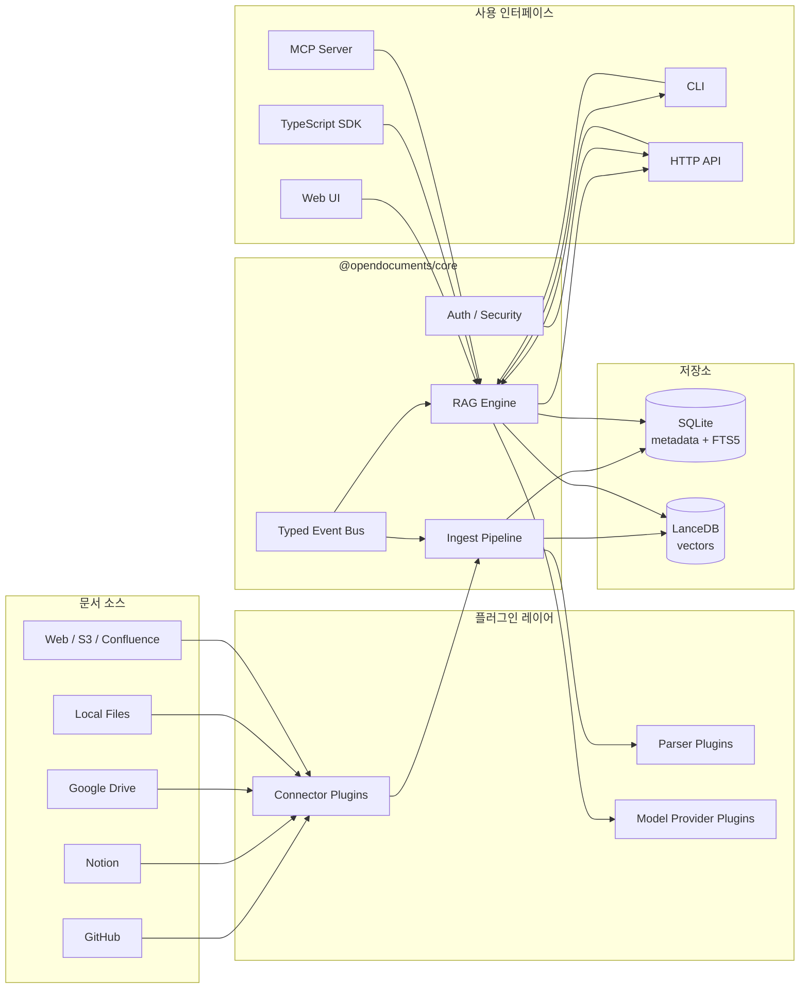
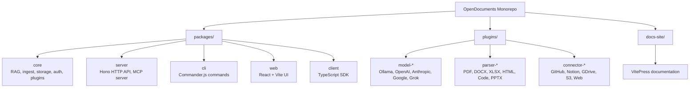
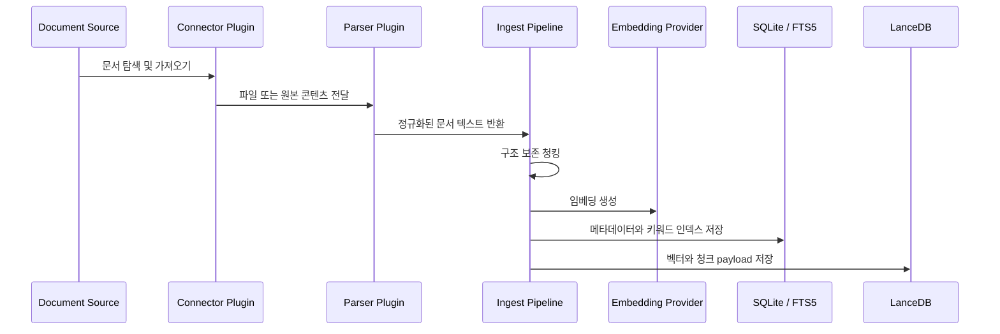
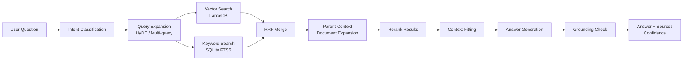
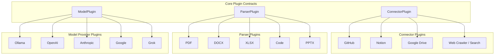
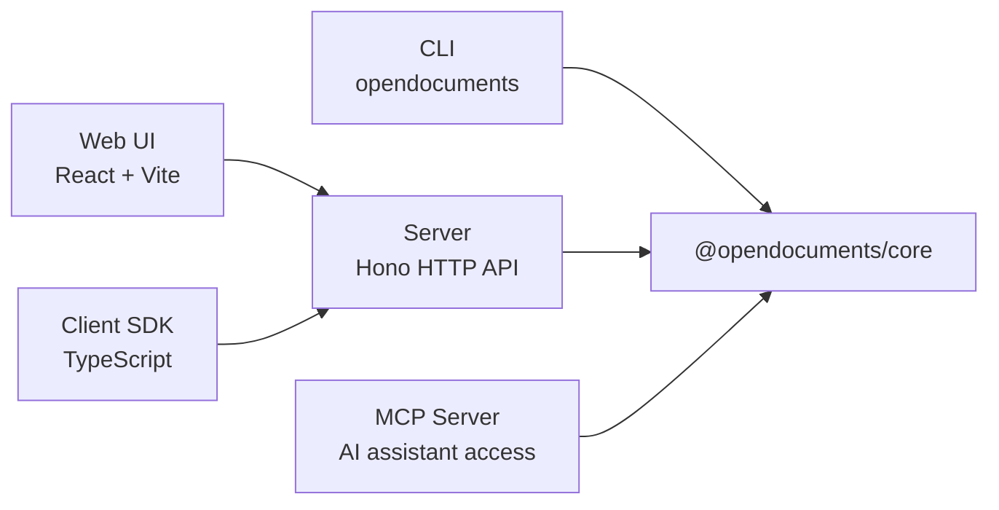

# OpenDocuments 아키텍처

[English](architecture.md) | 한국어

OpenDocuments는 GitHub, Notion, Google Drive, 로컬 파일 등 여러 소스에 흩어진 문서를 검색 가능한 지식 베이스로 만들고, 자연어 질문에 출처 기반 답변을 제공하는 자체 호스팅 RAG 플랫폼입니다.

설계의 중심 원칙은 세 가지입니다.

- **Core-first 설계**: 비즈니스 로직은 `@opendocuments/core`에 두고 CLI, server, web, SDK는 이를 재사용합니다.
- **Plugin-first 확장**: connector, parser, model provider를 독립 플러그인으로 분리합니다.
- **Source-grounded retrieval**: 검색된 문서 컨텍스트를 근거로 답변을 생성하고 출처를 함께 반환합니다.

## 시스템 개요

## 모노레포 구조

`@opendocuments/core`는 아키텍처의 중심 패키지입니다. ingest, retrieval, storage, auth, plugin system을 재사용 가능한 API로 제공하고, 외부 패키지는 이를 CLI, HTTP API, Web UI, SDK, MCP server 형태로 노출합니다.

## Ingest Pipeline

Ingest pipeline은 외부 문서를 검색 가능한 메타데이터와 임베딩으로 변환합니다.

주요 책임은 다음과 같습니다.

- 여러 소스에서 가져온 문서를 공통 document model로 정규화합니다.
- 제목, 섹션, 코드 블록 등 검색에 유용한 구조를 보존합니다.
- 메타데이터는 SQLite에, 벡터 payload는 LanceDB에 저장합니다.
- parser와 connector의 provider별 로직은 core pipeline 밖의 플러그인으로 분리합니다.

## RAG Pipeline

OpenDocuments는 semantic search, keyword search, query expansion, reranking, grounding check를 조합한 검색 파이프라인을 사용합니다.

주요 검색 기능은 다음과 같습니다.

- **Hybrid search**: LanceDB 기반 dense vector search와 SQLite FTS5 기반 keyword search를 함께 사용합니다.
- **RRF merge**: dense/sparse 검색 결과를 Reciprocal Rank Fusion으로 병합합니다.
- **HyDE and multi-query**: 어려운 질문을 검색에 더 적합한 쿼리로 확장합니다.
- **Parent document retrieval**: 매칭된 chunk 주변의 더 넓은 섹션 컨텍스트를 복원합니다.
- **Reranking**: 최종 context selection 전에 검색 결과 순위를 보정합니다.
- **Grounding check**: 생성된 답변이 검색된 출처에 근거하는지 확인합니다.

## 플러그인 아키텍처

OpenDocuments는 모델, 문서 포맷, 외부 문서 소스를 core RAG pipeline 변경 없이 추가할 수 있도록 플러그인 구조를 사용합니다.

이 구조를 통해 core package는 orchestration과 contract에 집중하고, provider별 구현은 plugin package가 소유합니다.

## 저장소 설계

OpenDocuments는 메타데이터 검색과 벡터 검색의 접근 패턴이 다르기 때문에 두 저장소를 분리해 사용합니다.

| Layer | Technology | Purpose |
| --- | --- | --- |
| Metadata store | SQLite | workspace, document, chunk, job, auth data |
| Keyword index | SQLite FTS5 | sparse keyword search, exact-match retrieval |
| Vector store | LanceDB | embedding, semantic similarity search |

이 설계는 로컬 자체 호스팅 환경을 단순하게 유지하면서도, 이후 storage implementation을 교체할 수 있는 경계를 남깁니다.

## 인터페이스 레이어

인터페이스 레이어는 얇게 유지합니다.

- CLI는 setup, indexing, ask, diagnostics, backup 명령을 제공합니다.
- Server는 HTTP API, auth middleware, MCP server, widget endpoint를 제공합니다.
- Web UI는 browser 기반 사용을 위해 server API를 소비합니다.
- TypeScript SDK는 외부 애플리케이션에서 사용할 수 있는 typed API client를 제공합니다.
- MCP server는 AI coding assistant가 문서 지식 베이스를 검색할 수 있게 합니다.

## 보안 고려사항

보안에 민감한 경로는 storage, server, query layer에서 처리합니다.

- SQL query는 parameterized statement를 사용합니다.
- SQLite FTS5 query는 실행 전에 escape합니다.
- LanceDB filter는 안전한 where-clause helper를 통해 생성합니다.
- team mode endpoint는 authentication middleware로 보호합니다.
- production error response에는 stack trace나 내부 path를 노출하지 않습니다.

## 설계 트레이드오프

| Decision | Why |
| --- | --- |
| SQLite + LanceDB | 자체 호스팅 구성을 단순하게 유지하면서 metadata search와 vector search를 분리하기 위해 선택 |
| Plugin-first architecture | 새로운 source, parser, model provider를 core 변경 없이 추가하기 위해 선택 |
| Core-first monorepo | CLI, server, web, SDK, MCP가 동일한 business logic을 재사용하기 위해 선택 |
| Hono server layer | core service를 감싸는 가벼운 TypeScript 친화 HTTP layer가 필요해 선택 |
| Retrieval profiles | fast, balanced, precise 모드로 속도와 검색 품질을 조절하기 위해 선택 |

