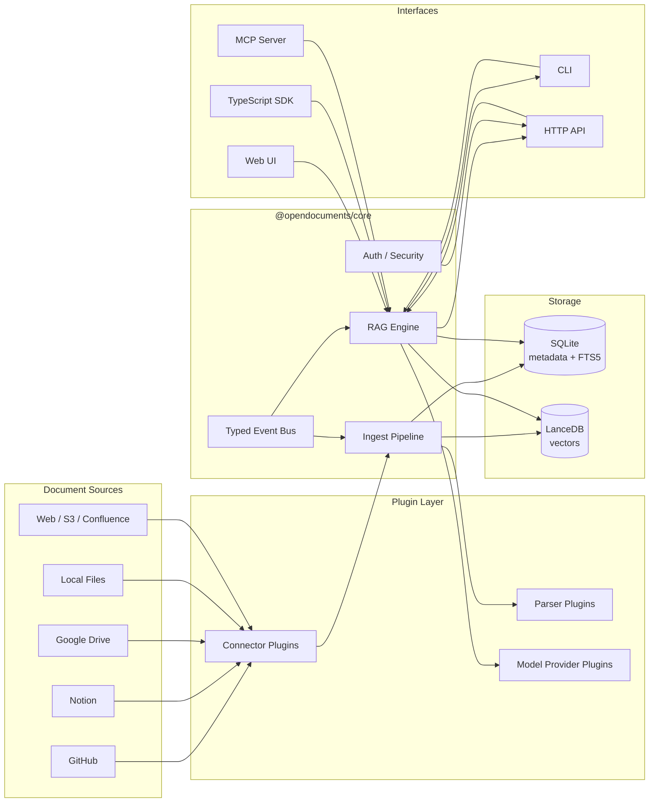
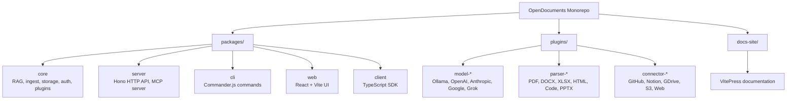
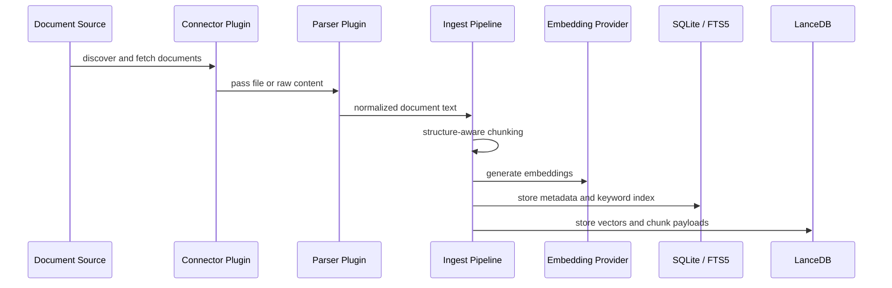
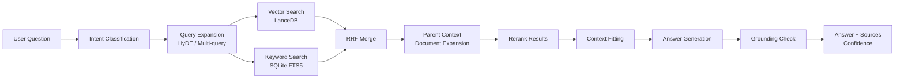
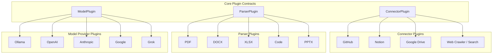
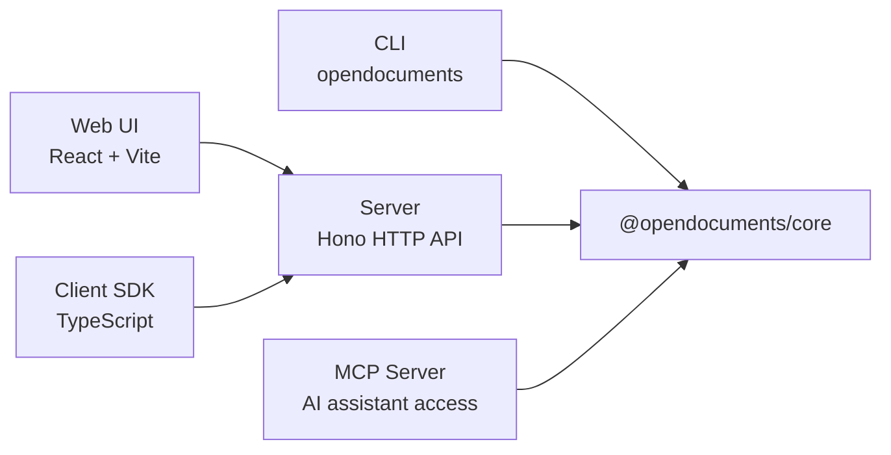

# OpenDocuments Architecture

[English](architecture.md) | [한국어](architecture.ko.md)

OpenDocuments is a self-hosted RAG platform for searching private documents across GitHub, Notion, Google Drive, local files, and other sources.

The system is designed around three principles:

- **Core-first design**: business logic lives in `@opendocuments/core`, while CLI, server, web, and SDK layers reuse it.
- **Plugin-first extension**: connectors, parsers, and model providers are independent plugins.
- **Source-grounded retrieval**: answers are generated from retrieved document context and returned with source references.

## System Overview

## Monorepo Layout

`@opendocuments/core` is the center of the architecture. It exposes reusable APIs for ingest, retrieval, storage, authentication, and plugins. The outer packages are protocol or user-interface layers.

## Ingest Pipeline

The ingest pipeline converts external documents into searchable metadata and embeddings.

Key responsibilities:

- Normalize documents from different sources into a common document model.
- Preserve useful structure such as headings, sections, and code blocks.
- Store metadata in SQLite and vector payloads in LanceDB.
- Keep parser and connector logic outside the core pipeline through plugins.

## RAG Pipeline

OpenDocuments uses a retrieval pipeline that combines semantic search, keyword search, query expansion, reranking, and grounding checks.

Important retrieval features:

- **Hybrid search**: combines dense vector search with SQLite FTS5 keyword search.
- **RRF merge**: merges dense and sparse search results with Reciprocal Rank Fusion.
- **HyDE and multi-query**: expands difficult questions into better retrieval queries.
- **Parent document retrieval**: restores broader section context around matching chunks.
- **Reranking**: improves final context selection before generation.
- **Grounding check**: verifies that generated answers are supported by retrieved sources.

## Plugin Architecture

Plugins let OpenDocuments add new models, document formats, and external sources without changing the core RAG pipeline.

This keeps the core package focused on orchestration and contracts, while plugin packages own provider-specific behavior.

## Storage Design

OpenDocuments uses two storage layers because metadata search and vector search have different access patterns.

| Layer | Technology | Purpose |
| --- | --- | --- |
| Metadata store | SQLite | workspaces, documents, chunks, jobs, auth data |
| Keyword index | SQLite FTS5 | sparse keyword search and exact-match retrieval |
| Vector store | LanceDB | embeddings and semantic similarity search |

This design keeps local self-hosted setup simple while preserving a clear path to swap storage implementations later.

## Interface Layers

Interface layers are intentionally thin:

- CLI exposes local commands for setup, indexing, asking, diagnostics, and backup.
- Server exposes HTTP APIs, authentication middleware, MCP server, and widget endpoints.
- Web UI consumes server APIs for browser-based operation.
- TypeScript SDK gives external applications a typed API client.
- MCP server exposes the knowledge base to AI coding assistants.

## Security Considerations

Security-sensitive paths are handled close to the storage, server, and query layers:

- SQL queries use parameterized statements.
- SQLite FTS5 queries are escaped before execution.
- LanceDB filters are built through safe where-clause helpers.
- Team mode endpoints are protected by authentication middleware.
- Error responses avoid leaking stack traces or internal paths in production.

## Design Tradeoffs

| Decision | Why |
| --- | --- |
| SQLite + LanceDB | Simple self-hosted setup with separate metadata and vector search layers |
| Plugin-first architecture | New sources, parsers, and model providers can be added without changing core |
| Core-first monorepo | CLI, server, web, SDK, and MCP reuse the same business logic |
| Hono server layer | Lightweight TypeScript-friendly HTTP layer around core services |
| Retrieval profiles | Users can trade speed for quality with fast, balanced, and precise modes |
